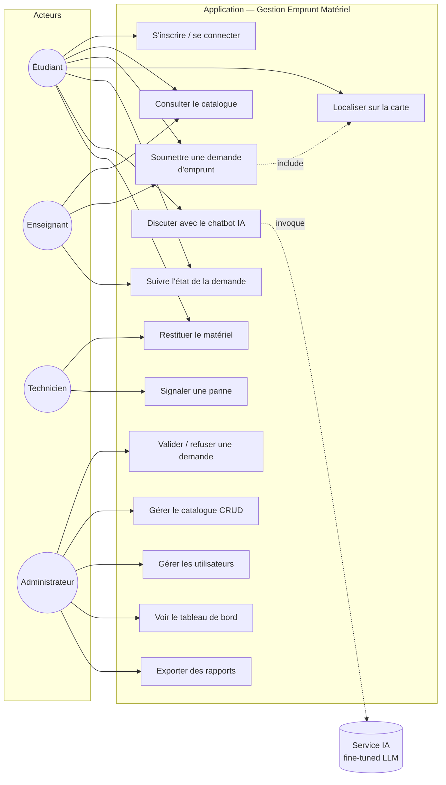

# Diagramme des cas d'utilisation (UML)

> Phase 1 — Conception. Identifie les acteurs et les interactions principales du système.

## Acteurs

- **Étudiant** : utilisateur principal, demande des emprunts.
- **Enseignant** : peut emprunter du matériel et superviser les étudiants.
- **Technicien** : gère le retour matériel, signale les pannes.
- **Administrateur** : valide les demandes, gère le catalogue, voit les statistiques.
- **Chatbot IA** : acteur système, répond aux questions sur le matériel.

## Diagramme (Mermaid)

## Description textuelle des cas principaux

### UC3 — Soumettre une demande d'emprunt
- **Acteur** : Étudiant
- **Préconditions** : être authentifié.
- **Scénario nominal** :
  1. L'étudiant accède au catalogue.
  2. Il sélectionne un ou plusieurs matériels.
  3. Il saisit dates de début et de fin.
  4. Il indique l'emplacement d'utilisation (adresse + clic sur carte).
  5. Il valide ; la demande passe à l'état *en attente*.
- **Postconditions** : notification envoyée à l'admin.

### UC6 — Discuter avec le chatbot IA
- **Acteur** : Étudiant
- **Préconditions** : être authentifié.
- **Scénario nominal** :
  1. L'étudiant ouvre le chat.
  2. Il pose une question (ex. : "Comment mettre en station une station totale Leica TS06 ?").
  3. Le service IA renvoie une réponse fine-tunée.
  4. Si hors périmètre, redirection vers la documentation ou le responsable.

### UC9 — Valider / refuser une demande
- **Acteur** : Administrateur
- **Scénario** : consulte la file des demandes en attente, examine la disponibilité, approuve ou refuse en ajoutant un motif.
