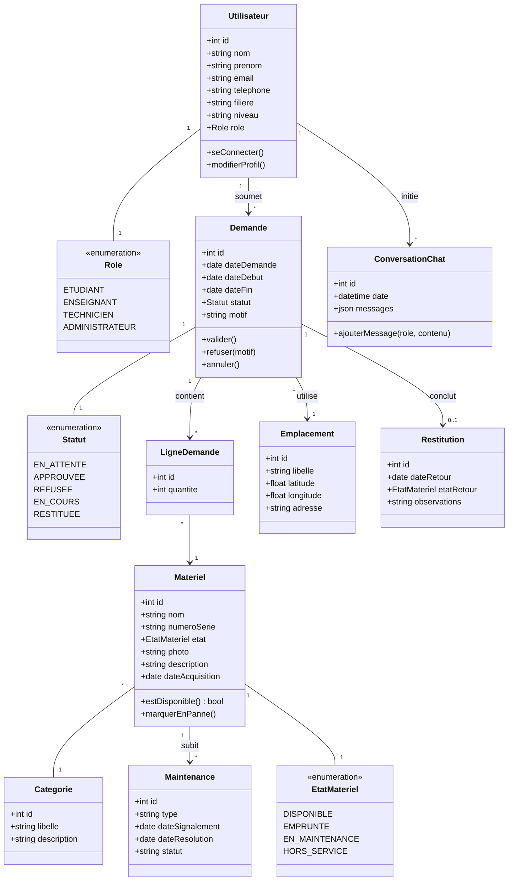

# Diagramme de classes (UML)

> Phase 1 — Conception. Vue orientée objet du domaine métier. Cette structure guidera directement l'écriture des modèles Django en Phase 2.

## Diagramme (Mermaid)

## Cardinalités principales

| Relation | Cardinalité | Sens |
|----------|-------------|------|
| Utilisateur — Demande | 1..* | Un utilisateur peut faire plusieurs demandes |
| Demande — LigneDemande | 1..* | Une demande contient plusieurs lignes (matériels différents) |
| LigneDemande — Matériel | * — 1 | Une ligne référence un seul matériel |
| Demande — Emplacement | 1 — 1 | Une demande a un et un seul emplacement |
| Demande — Restitution | 1 — 0..1 | Restitution optionnelle (existe seulement après retour) |
| Matériel — Catégorie | * — 1 | Un matériel appartient à une catégorie |
| Matériel — Maintenance | 1..* | Un matériel peut avoir plusieurs maintenances |

## Justifications de conception

- **Enum `Role`, `Statut`, `EtatMateriel`** : valeurs fermées, contrôlées au niveau modèle (en Django : `choices`).
- **`LigneDemande` (table d'association)** : permet d'emprunter plusieurs matériels en une seule demande, avec des quantités.
- **`Emplacement` séparé** : on pourra plus tard avoir plusieurs emplacements par demande (mission de plusieurs jours), évolutif.
- **`ConversationChat`** : stockage JSON des messages pour rester souple et faciliter l'export vers un fichier d'apprentissage.
