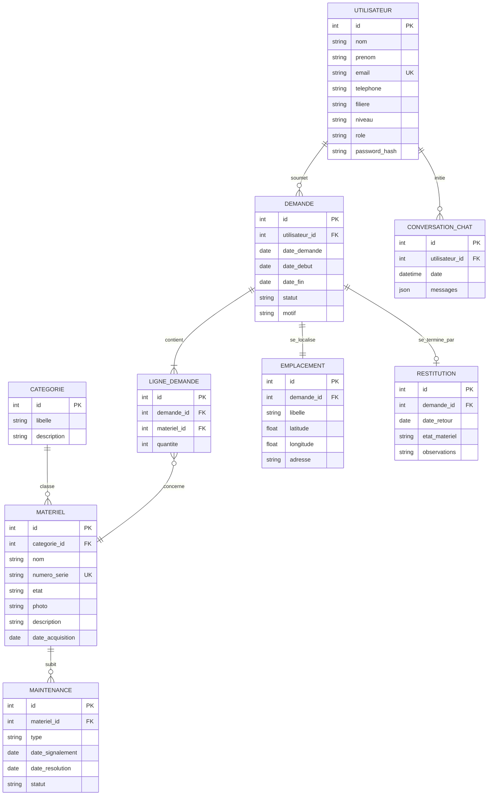

# Modèle Conceptuel de Données (MCD) et Modèle Logique (MLD)

> Phase 1 — Conception. Vue base de données du système (méthode Merise).

## 1. Modèle Conceptuel de Données (MCD)

## 2. Modèle Logique de Données (MLD) — schéma relationnel

Notation : **clé primaire en gras**, *clé étrangère en italique*.

- **Utilisateur** (**id**, nom, prenom, email, telephone, filiere, niveau, role, password_hash)
- **Categorie** (**id**, libelle, description)
- **Materiel** (**id**, *categorie_id*, nom, numero_serie, etat, photo, description, date_acquisition)
- **Demande** (**id**, *utilisateur_id*, date_demande, date_debut, date_fin, statut, motif)
- **LigneDemande** (**id**, *demande_id*, *materiel_id*, quantite)
- **Emplacement** (**id**, *demande_id*, libelle, latitude, longitude, adresse)
- **Restitution** (**id**, *demande_id*, date_retour, etat_materiel, observations)
- **Maintenance** (**id**, *materiel_id*, type, date_signalement, date_resolution, statut)
- **ConversationChat** (**id**, *utilisateur_id*, date, messages)

## 3. Contraintes d'intégrité

- `Utilisateur.email` est **UNIQUE** (login).
- `Materiel.numero_serie` est **UNIQUE**.
- `Demande.date_fin >= Demande.date_debut` (contrainte CHECK).
- `Demande.statut ∈ {EN_ATTENTE, APPROUVEE, REFUSEE, EN_COURS, RESTITUEE}`.
- `Materiel.etat ∈ {DISPONIBLE, EMPRUNTE, EN_MAINTENANCE, HORS_SERVICE}`.
- ON DELETE CASCADE : supprimer une `Demande` supprime ses `LigneDemande`, son `Emplacement` et sa `Restitution`.

## 4. Notes pour l'implémentation Django

- Django créera automatiquement les clés primaires `id` (AutoField).
- Les clés étrangères deviennent des `ForeignKey(...)`.
- Les énumérations (`role`, `statut`, `etat`) → `models.CharField(choices=...)`.
- Les contraintes CHECK → `Meta.constraints` avec `CheckConstraint`.
