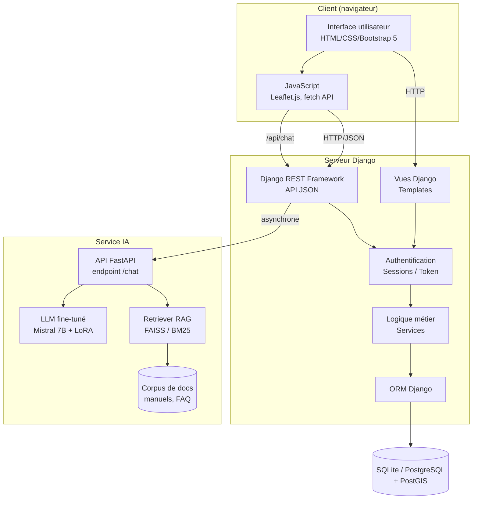
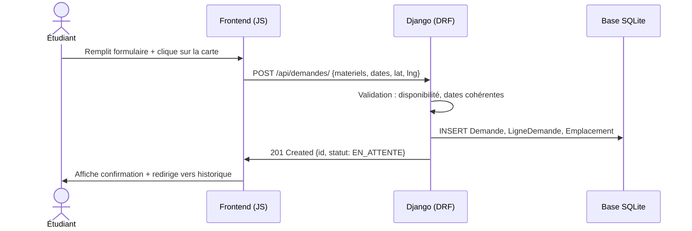
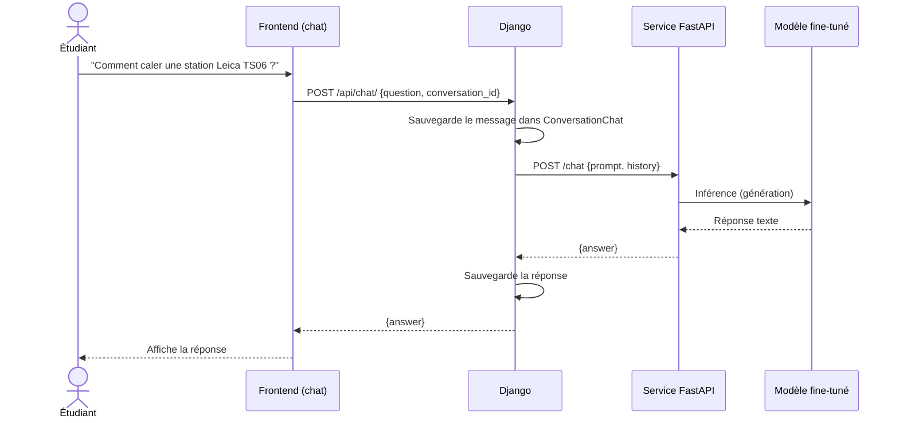

# Architecture générale du système

> Phase 1 — Conception. Vue technique : composants, flux, déploiement.

## 1. Vue d'ensemble (architecture en couches)



## 2. Choix techniques justifiés

| Couche | Choix | Justification |
|--------|-------|---------------|
| Backend | Django + DRF | Robuste, ORM puissant, admin auto-généré, écosystème mûr |
| Front | Bootstrap 5 + JS vanilla | Léger, pas de build complexe, suffisant pour le périmètre |
| Carto | Leaflet.js + OSM | Open source, simple à intégrer, gratuit |
| BDD | SQLite (dev), PostgreSQL+PostGIS (prod) | SQLite pour simplifier le setup local ; PostGIS pour la recherche spatiale en prod |
| IA | LoRA/QLoRA via Hugging Face | Réduit drastiquement les besoins GPU (4-bit), permet l'entraînement sur Colab gratuit |
| Service IA | FastAPI séparé | Découplage : on peut redémarrer le LLM sans toucher Django |

## 3. Découpage en applications Django

```
backend/
├── config/              # settings, urls, wsgi
├── users/               # Utilisateur custom (rôles)
├── materiel/            # Matériel, Catégorie, Maintenance
├── emprunts/            # Demande, LigneDemande, Emplacement, Restitution
├── chatbot/             # ConversationChat + client vers API IA
└── api/                 # Routage DRF (regroupe les viewsets)
```

**Principe** : une *app Django par domaine fonctionnel*, pour rester modulaire et testable.

## 4. Flux nominal — "Soumettre une demande"



## 5. Flux IA — "Question au chatbot"



## 6. Principes POO appliqués

- **Encapsulation** : chaque modèle expose des méthodes métier (`Demande.valider()`) plutôt que de manipuler les attributs depuis l'extérieur.
- **Héritage** : `Utilisateur` hérite de `AbstractUser` Django pour ajouter `role`, `filiere`, `niveau`.
- **Polymorphisme** : la méthode `__str__()` est redéfinie sur chaque modèle pour un affichage cohérent dans l'admin.
- **Abstraction** : la couche IA est isolée derrière une interface `ChatService` — on peut remplacer le modèle sans toucher au reste.

## 7. Sécurité

- Authentification par session Django (cookies HttpOnly).
- CSRF activé par défaut sur toutes les vues POST.
- Hashage des mots de passe via `PBKDF2` (par défaut Django).
- Permissions DRF : `IsAuthenticated` partout, `IsAdminUser` pour les endpoints d'administration.
- Pas de secrets en dur : toutes les clés dans `.env` (jamais commit).
